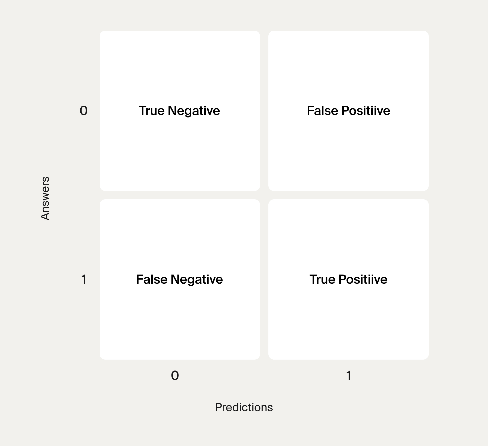

# Feature_Engineering_Sprint_9
Transforming raw data into powerful predictive signals through encoding, scaling, polynomial features, and intelligent feature selection.

## Feature engineering
 is the art and science of transforming raw data into the optimal input format for machine learning algorithms. It's where domain knowledge meets technical skill, and where good practitioners separate themselves from great ones.

## What we'll learn:

* Feature engineering- transforming raw data into powerful predictive signals through encoding, scaling, polynomial features, and intelligent feature selection

* Imbalanced data solutions
handling real-world scenarios where classes are unequal, using sampling techniques, threshold adjustment, and advanced evaluation metrics

*Professional model evaluation

using learning curves, validation curves, and ROC analysis to understand model behavior and make deployment decisions.

## What We’ll be learning:

Data Cleaning and Preparation
Missing value strategies
    When to fill, when to drop, and how different approaches affect model performance
Feature scaling and normalization
    Why some algorithms fail without proper scaling and how to choose the right technique
Categorical Data Mastery
    One-hot encoding
        Converting categories like "Red", "Blue", "Green" into numerical formats algorithms can understand

    Label and ordinal encoding
        Handling categories with natural ordering like "Small", "Medium", "Large"
    The dummy variable trap
        A subtle but critical mistake that can ruin model performance
Advanced Feature Creation
    Polynomial features
        Creating interaction terms that capture complex relationships between variables
    Feature selection
        Identifying which features actually improve predictions and eliminating noise
    Feature importance analysis
        Understanding which data points drive your model's decisions
Professional Workflows

    ML pipelines
        Building automated systems that prevent data leakage and ensure reproducible results

## machine learning algorithms only understand numbers.
Understanding Categorical Data Types

Nominal Categories (No Natural Order)
Characteristics: Categories with no inherent ranking or order

Examples from real estate:

Neighborhood: Downtown, Suburbs, Rural (no clear "best" to "worst" order)
Property_Type: House, Apartment, Condo (different types, not ranked)
Exterior_Color: Red, Blue, White, Gray (purely descriptive)
Key insight: There's no mathematical relationship between categories. Blue isn't "greater than" Red.

Ordinal Categories (Natural Order Exists)
Characteristics: Categories with clear ranking or hierarchy

Examples from real estate:

Condition: Poor < Fair < Good < Excellent (clear quality progression)
Size_Category: Small < Medium < Large (obvious ordering)
School_Rating: F < D < C < B < A (grade-based hierarchy)
Key insight: Order matters, and the algorithm should understand this ranking.
 
 The Solution Preview
Different categorical types require different handling approaches:

For Nominal Categories (no order):

One-Hot Encoding: Create separate yes/no columns for each category
Preserves all information without implying false relationships
For Ordinal Categories (natural order):

Label Encoding: Assign meaningful numbers that respect the natural ordering
Ordinal Encoding: More sophisticated approach with proper spacing

## Systematic Feature Type Assessment

The Two-Stage Assessment Strategy
Professional data scientists check feature types twice during every project:

Stage 1: Initial Dataset Assessment
When: Immediately after loading the dataset
Purpose: Get familiar with your data structure
Questions to answer:

How many features do I have?
Which appear to be categorical vs numerical?
Are there obvious data quality issues?

Stage 2: Post-Preprocessing Validation

When: After handling missing values, duplicates, and manual type conversions
Purpose: Sanity check before model training
Questions to answer:

Did my preprocessing steps work correctly?
Are all features in the expected format?
Are categorical features properly encoded?

Encoding Overview:
 OHE :in regression, the categories have to be encoded in a way that assigns equal importance to all of them.One-Hot Encoding (OHE) for nominal variables — it creates separate yes/no columns without implying any order!
 For tree-based algorithms, cateogories are often strings we should convert them to numbers . Here is when label Encoding comes into play.

  As for ordinal variables, it is better to use Ordinal Encoding, regardless of the algorithm.
  It is used in a tree-based algorithm (some machine learning frameworks support unencoded categorical variables for trees, however, if they don't, Label Encoding is an option).
It is an ordinal variable (Ordinal Encoding should be used for ordinal variables).
It is a high cardinality variable (more advanced encoding techniques might be needed).

=========================================================================
## Classification Metrics: Accuracy for the Decision Tree
Accuracy is a metric that is used for classification tasks. 
Accuracy can be calculated with the accuracy_score() function available in the sklearn.metrics module. It takes two arguments: correct targets and predictions, and returns the calculated accuracy score.

### Sanity Cehck
To assess the accuracy of the model, let's first examine the targets in our dataset. Since we have a binary classification problem, the targets can only be either 0 or 1. We are interested to know how many 0s and 1s are in the dataset that we are working with. To do that, we will use the value_counts() method learned previously.

You know that the count for each unique value in a given column can be calculated using value_counts() in the following manner: data['particular_column'].value_counts(). As an option, we can consider setting True to the normalize= parameter within the value_counts() method to get the output in relative units.

### True Positive
What does a True Positive answer (TP) mean? In this case, the model labeled an observation as 1, and its actual value is also 1. 

If the predicted and actual class values are negative, then the answer is True Negative.

### True Negative 
If the predicted and actual class values are negative, then the answer is True Negative.

In our task, the True Negative answer (TN) is the number of insured people who:

according to the model's prediction did not request a payment, AND
didn't actually apply for insurance compensation.

### False Postivie 
 
 Algorithms are like humans — they make errors. These errors fall into two categories.

The first type of error is a False Positive (FP). It occurs when the model predicted "1", but the actual value of the class is "0".

### False Negative

The second type of error are False Negative answers (FN).

False Negative answers occur when the model predicts "0", but the actual value of the class is "1".

In our task, a False Negative answer is the number of insured people who:

according to the model's prediction did not request a payment, BUT
in fact, did make a claim.

### Confusion Matrix

The confusion matrix is formed as follows:

The shape of the matrix is created
labels predicted by an algorithm (0 and 1) are placed on the horizontal axis ("Predictions");

actual labels (0 and 1) are placed on the vertical axis ("Answers").
   
    -------------------------
        TP      |    FN
   ------------ |------------
       FP       |    TN
  --------------------------

Now we have a 2 by 2 grid, but it is not a confusion matrix yet. To become a confusion matrix, it needs to be filled with the values of our four possible outcomes. Therefore, our second step is...

Filling in the matrix with the TP, FP, TN and FN values using the following rules:
The correct predictions are placed on the main diagonal (from the upper-left corner):
TN in the upper-left corner
TP in the lower right corner
Incorrect predictions are outside of the main diagonal:
FP in the upper right corner
FN in the lower-left corner

### Recall  # of all the TP how many model successfully find 
 the proportion of positive answers marked positive by the model (TP) to the positive answers marked positive by the model (TP) plus the answers marked negative by the model that are actually positive (FN). 
 
                    Recall = TP/TP+FN

### precision: When I say How often am I right?

Precision measures how many negative answers the model found while searching for positive ones. 
                   
                   percision = TP/TP+FP

**`Similar to recall, we want the precision to be close to one.`**

F1Score:
Recall and precision evaluate the quality of predictions of the positive class from different angles. Recall describes how well a model understands the properties of this class and is able to recognize it. Precision detects whether a model is overdoing the positive class recognition by assigning too many positive labels.

Both recall and precision are important, but sometimes we need a little more. Here is where we can use an aggregating metric, the F1 score, to work with both recall and precision simultaneously. Basically, the F1 score is the harmonic mean of recall and precision.

F1 score =2×Precision × Recall/ Precision + Recall

It's important to understand that when either recall or precision is close to zero, the harmonic mean is close to 0.

